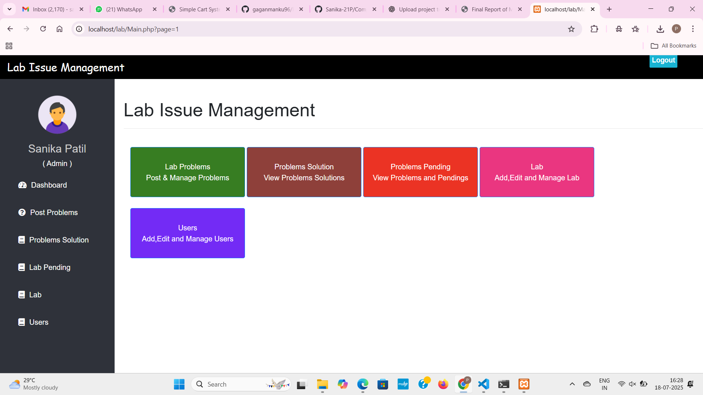

# 💻 Computer Lab Issue Notify System

A web-based application designed for institutions to report and resolve issues in computer labs efficiently. This system helps faculty members and administrators communicate technical problems and manage resolutions quickly and transparently.

## 📝 Project Overview

The **Computer Lab Issue Notify System** is a PHP-MySQL based application designed to streamline the reporting and resolution process for computer lab issues. It allows faculty and staff to log issues, notifies lab assistants in real-time via email, and enables admins to track and manage problems through a centralized dashboard.

## 🚀 Features

- 🧑‍🏫 **Teacher Panel**
  - Report software/hardware/network issues
  - View previously submitted complaints

- 🛠️ **Lab Assistant Panel**
  - View all reported issues
  - Mark issues as resolved (completely/partially/not solved)
  - Send resolution status via email

- 👨‍💼 **Admin Panel**
  - Manage users (teachers/lab assistants)
  - Assign labs to assistants
  - Track resolved/pending issues
  - Add lab infrastructure

- 📬 **Email Notification**
  - Real-time alerts to lab assistants when issues are reported
  - Notifications to faculty when issues are updated

## 🛠️ Technologies Used

| Technology      | Purpose                         |
|-----------------|----------------------------------|
| HTML, CSS       | Frontend design                 |
| Bootstrap       | Responsive UI                  |
| JavaScript      | Client-side interaction        |
| PHP             | Backend scripting              |
| MySQL           | Database                       |
| XAMPP           | Local server environment       |
| Chart.js        | Visual data representation     |
| Email (PHPMailer) | Notification handling         |

## 📥 Installation & Setup

### Requirements
- PHP >= 7.4
- MySQL
- XAMPP or similar server environment
- Web browser

### Steps to Run Locally

1. Download or Clone the Repo:
   ```bash
   git clone https://github.com/Sanika-21P/Computer-Lab-Issue-Notify-System.git
   ```

2. Copy project folder to `htdocs/` in XAMPP.

3. Start Apache and MySQL from XAMPP control panel.

4. Create Database:
   - Open phpMyAdmin at: `http://localhost/phpmyadmin`
   - Create a database (e.g., `lab_notify`)
   - Import the provided SQL file from the project folder

5. Access the system:
   ```
   http://localhost/Lab/
   ```

## ⚙️ Modules Description

### 🔐 1. Login System
- Faculty, Lab Assistants, and Admin can login using email and password.
- Admin has authority to create new users.

### 📝 2. Report Problem
- Faculty/Admin submits issue with lab name, subject, and problem description.
- Issue is stored and notification is sent to Lab Assistant.

### 🧑‍🔧 3. Resolve Problem
- Lab assistant views all problems
- Selects status: **Complete / Partial / Not Solved**
- Sends email update to the faculty

### ⏳ 4. Pending Issues
- Unresolved or partially resolved issues are tracked
- Admin can monitor the pending issues

### 📢 5. Notifications
- All communication between users and lab assistants is done via email notifications

### 👥 6. User & Lab Management
- Admin can add, delete or update user details
- Labs can be assigned to specific assistants

## 📷 Screenshots

> Below are sample screens from the system as implemented in the report.

- 
- 
- 
- 
- 
- 
- 


